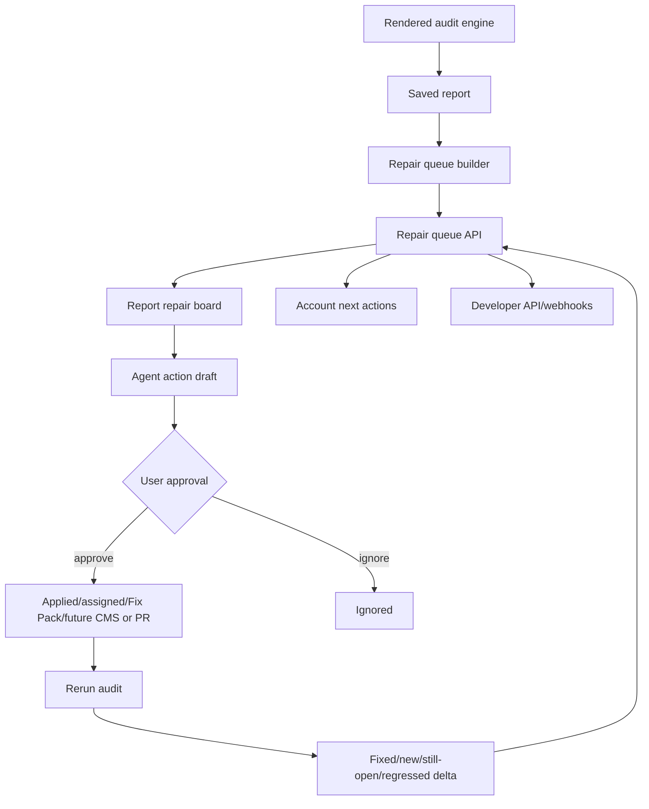

# feat: Build SEOFixKit Agent Repair Model

## Summary

Build SEOFixKit into a proof-first self-serve and agent-assisted repair product by adding public proof/methodology surfaces, a persistent repair queue, approval-safe agent action records, AI Answer Readiness checks, and gap-backed growth suggestions over the existing rendered audit engine.

---

## Problem Frame

The current product already proves and briefs SEO repairs, but it still behaves like an audit/report workbench. The competitor benchmark shows that buyers now expect a self-serve agent loop: enter a URL, receive prioritized opportunities, approve assisted actions, and see proof that the work changed outcomes. The Ahrefs benchmark adds a second pressure: buyers also expect deep SEO/AI data, free verified-site access, patch-style fixes, MCP/agent workflows, and always-on monitoring. SEOFixKit should satisfy the repair-agent expectation without becoming a generic content autopilot, an Ahrefs data-suite clone, or an unproven AI-visibility tracker.

---

## Requirements

### Public Proof And Trust

- R1. Add public surfaces that show the proof loop before payment: sample proof report, methodology, limits, and package ladder.
- R2. Keep public copy truth-safe: no backlink exchange, no Ahrefs/Semrush replacement claim, no AI visibility tracking without engine sampling or imported evidence, no 50K rendered-validation claim beyond actual batch proof.

### Repair Queue

- R3. Convert saved report findings and repair-plan items into a durable repair queue with status, action mode, source proof, acceptance check, and rerun result.
- R4. Preserve current team assignment and notes while adding agent-specific states such as drafted, approved, applied, fixed, ignored, and regressed.
- R5. Expose queue state in the report view, account dashboard, client/agency surfaces where appropriate, and Developer API where privacy allows.

### Agent-Assisted Execution

- R6. Add approval-safe agent action records that can draft copy/paste fixes, CMS-ready metadata text, Fix Pack handoff, and future GitHub/CMS actions without performing risky writes.
- R7. Record every proposed action with source proof, proposed change, approval state, execution state, and rerun state.
- R8. Do not auto-publish, auto-merge, or call provider admin APIs from the browser.

### AI Answer Readiness And Growth

- R9. Add AI Answer Readiness findings based on rendered/site proof only.
- R10. Add gap-backed growth suggestions from verified sources such as low CTR imports, competitor gaps, missing structured FAQ/schema, and crawl proof.
- R11. Keep all growth output draft-only until explicit provider integrations and approval controls exist.
- R11a. Treat Ahrefs/GSC/rank/backlink/Brand Radar-style data as optional evidence inputs or future connectors, not native database claims.

### Monitor And Re-Measure

- R12. Use report deltas and weekly monitors to drive next best repair, fixed/new/still-open/regressed states, and account dashboard next actions.
- R13. Keep rerun evidence as the only authority for marking proof-backed fixes fixed.

---

## Key Technical Decisions

- **Extend current report and collaboration surfaces before adding external integrations:** The repo already has saved reports, issue collaboration, report deltas, Fix Pack checkout, API keys, webhooks, and weekly schedules. The first build should add a repair-agent data layer over those primitives instead of jumping straight to CMS/GitHub provider automation.
- **Use D1 for repair queue/action records:** Existing private-beta state lives in D1, and the queue needs owner-scoped persistence, retention, status updates, and API visibility.
- **Keep AI Answer Readiness proof-derived:** Initial checks should be generated from rendered page facts, schema, robots/sitemap/`llms.txt`, canonical/internal-link clarity, and structured content signals. Live AI-engine sampling is explicitly deferred.
- **Draft first, execute later:** Agent actions should first produce reviewable drafts and activity records. CMS writes and GitHub PRs become later integrations gated by explicit connections and approvals.
- **Data-suite companion, not replacement:** Ahrefs sets the standard for proprietary keyword, backlink, crawler, rank-tracking, AI-visibility, MCP, and agent data access. SEOFixKit should consume supplied/imported data where useful, but the core product remains proof-backed repair execution for an authorized site.
- **Patch-style fixes need proof discipline:** Ahrefs Patches validates the issue-to-fix workflow. SEOFixKit should only add similar apply paths when approval state, rollback notes, owner scope, and rerun acceptance are preserved.
- **Treat public methodology as a product feature:** SEOitis wins trust with methodology and limits. SEOFixKit should ship that surface alongside the queue, not after integrations.

---

## High-Level Technical Design

The implementation starts with the queue and action-record loop. CMS/GitHub actions remain future execution targets until the approval, activity, and rerun model is stable.

---

## Implementation Units

### U1. Public Proof, Methodology, And Package Surfaces

- **Goal:** Make the proof loop and package ladder visible before a buyer enters the private workbench.
- **Files:** `worker/routes/pages.js`, `src/App.jsx`, `src/styles.css`, `public/sitemap.xml`, `README.md`.
- **Approach:** Extend the existing `/demo`, support/terms-style page helpers, homepage copy, and `llms.txt` truth surface with a sample proof report, methodology/limits page, and package ladder. Keep checkout and recurring-plan claims truthful.
- **Test scenarios:** Public routes render with no private data; methodology copy states limits; homepage points to sample proof; sitemap and `llms.txt` remain truthful; no claims say AI visibility tracking or completed 50K rendered validation.
- **Verification:** Build and browser-check the public pages across desktop/mobile; run the project check before ship.

### U2. Repair Queue Data Model

- **Goal:** Persist repair queue and agent action state separately from immutable report JSON.
- **Files:** `migrations/0028_agent_repair_queue.sql`, `worker/routes/reports.js`, `worker/lib/serializers.js`, `shared/audit-engine.js`, `shared/repair-queue.js` (new).
- **Approach:** Add owner-scoped queue/action tables that reference report IDs and issue IDs, preserve current `issue_collaboration` behavior, and derive default queue rows from report findings/repair plans when none exist. Use stable issue IDs from the current findings and store proof/action snapshots so later report mutations do not erase action history.
- **Test scenarios:** Existing reports get derived queue rows; saved statuses survive reload; queue rows cannot be read by another owner; expired/deleted reports do not leak action data; issue-collaboration status still works.
- **Verification:** Add focused Worker route/unit coverage for queue derivation and ownership checks; run relevant smoke tests plus full project check.

### U3. Repair Queue And Agent Action APIs

- **Goal:** Add private APIs for reading queue state, saving status, drafting action records, approving/ignoring actions, and linking rerun results.
- **Files:** `worker/routes/repair-agent.js` (new), `worker/index.js`, `worker/routes/reports.js`, `worker/lib/serializers.js`, `worker/lib/auth.js`.
- **Approach:** Add beta-session-protected endpoints under report scope, for example report queue read/update and action draft/approval transitions. Reuse `ownerReportRow`, report ownership checks, and no-store JSON responses. Keep all actions as records; do not perform external writes in this unit.
- **Test scenarios:** Unauthed requests fail; another owner cannot mutate a queue; invalid issue IDs fail; draft action records require report proof; approval changes action state but does not publish; rerun job IDs can be linked only for the same owner/host.
- **Verification:** Add route-level tests or smoke coverage for auth, owner isolation, transition validation, and no external side effects.

### U4. Report Repair Queue UI

- **Goal:** Replace the report's passive repair sections with an action-oriented repair queue that still exposes proof, snippets, acceptance checks, assignment, and Fix Pack paths.
- **Files:** `src/App.jsx`, `src/styles.css`.
- **Approach:** Extend `ReportView` and `TeamRepairBoard` into a queue-first panel. Keep team assignment and note editing, add status filters, action-mode controls, draft/approval affordances, and rerun state. Keep proof visible near every action.
- **Test scenarios:** Report with findings shows queue cards; report with no findings shows no-repair state; user can save status/assignee/note; draft action state is visible; long copy fits on mobile; protected report links do not expose private controls.
- **Verification:** Run build and in-browser checks on report, account dashboard, and mobile viewport.

### U5. Account Agent Feed And Next Actions

- **Goal:** Make the workspace feel like an agent feed, not a report archive.
- **Files:** `worker/routes/account.js`, `worker/lib/serializers.js`, `src/App.jsx`, `src/styles.css`.
- **Approach:** Extend account summary with queue counts, urgent repair items, draft actions awaiting approval, regressions from report deltas, monitor status, and next best action. Keep the existing verified-site and running-audit guidance but rank proof-backed repair work higher.
- **Test scenarios:** New user sees verification/first-audit guidance; user with open repairs sees highest-priority queue item; user with approved/applied actions sees rerun guidance; user with monitor regressions sees regression action; account data remains owner-scoped.
- **Verification:** Add account-summary tests where practical and browser-check empty, active, and post-report states.

### U6. AI Answer Readiness Module

- **Goal:** Add truth-safe AI-readiness checks without claiming live AI visibility.
- **Files:** `shared/ai-answer-readiness.js` (new), `shared/audit-engine.js`, `shared/white-label-report.js`, `worker/lib/serializers.js`, `src/App.jsx`.
- **Approach:** Build checks from rendered content, schema presence/types, canonical/internal-link clarity, robots/sitemap/`llms.txt` accessibility, FAQ/article/product structure, and citation-friendly page text. Merge resulting repair opportunities into `repairPlan` and queue derivation.
- **Test scenarios:** JavaScript app shell with low rendered content gets a readiness finding; valid schema/canonical/content avoids false positives; missing/inaccessible `llms.txt` is advisory not a ranking claim; findings include acceptance checks and enter the repair queue.
- **Verification:** Add shared-module tests and run audit smoke tests.

### U7. Gap-Backed Growth Suggestions

- **Goal:** Produce draft-only growth suggestions from verified gaps rather than generic article volume.
- **Files:** `shared/growth-opportunities.js` (new), `shared/audit-engine.js`, `shared/keyword-rank-audit.js`, `shared/competitor-benchmark.js`, `src/App.jsx`, `shared/white-label-report.js`.
- **Approach:** Combine existing keyword import outputs, competitor repair gaps, AI Answer Readiness, and crawl proof into brief-style opportunities such as page refresh, FAQ block, comparison outline, or free-tool idea. Include proof source and keep outputs as briefs/drafts.
- **Ahrefs note:** Future Ahrefs, Brand Radar, or MCP-derived evidence should enter this module through the same imported-data boundary as keyword/backlink rows, not as a hidden native-data claim.
- **Test scenarios:** Low-CTR keyword import creates a page-refresh brief; competitor gap creates comparison/repair suggestion; no supporting input means no growth suggestion; generated copy does not claim auto-publish or ranking gains.
- **Verification:** Add shared-module tests and verify report/white-label rendering.

### U8. Developer API And Webhook Exposure

- **Goal:** Make repair queue/action state usable for agencies and technical users without exposing private data.
- **Files:** `worker/routes/developer-api.js`, `worker/lib/serializers.js`, `worker/lib/webhooks.js`, `worker/lib/webhooks.test.mjs`, `src/App.jsx`.
- **Approach:** Add read endpoints or extended audit issue payloads for queue/action status, plus webhook event types for action drafted/approved/fixed where appropriate. Keep API tokens scoped to owner and signed webhooks.
- **Test scenarios:** API issue payload includes safe queue status; webhook events are signed; revoked tokens fail; client reports and public shares do not expose private action records.
- **Verification:** Extend webhook tests and local Developer API security smoke tests.

### U9. Fix Pack And Package Ladder Alignment

- **Goal:** Align Fix Pack, billing, and package copy with the new queue model while keeping Dodo as source of truth.
- **Files:** `worker/routes/billing.js`, `shared/fulfillment.js`, `worker/lib/serializers.js`, `src/App.jsx`, `README.md`.
- **Approach:** Tie Fix Pack CTA and checkout context to selected queue items when possible, show status as one proof-backed repair pass plus rerun, and surface future Repair Agent/Growth Add-On as roadmap/package copy only until recurring billing exists.
- **Test scenarios:** Checkout still requires a report with proven fixes; no hardcoded prices appear; paid request protects original/final reports; billing page does not pretend subscription is live.
- **Verification:** Run Dodo payment smoke test and full project check.

### U10. Documentation, Runbooks, And Release Gates

- **Goal:** Keep implementation truth, public claims, and operator docs aligned.
- **Files:** `README.md`, `docs/research/2026-06-18-outrank-seoitis-benchmark.md`, `docs/brainstorms/2026-06-18-seofixkit-agent-repair-model-requirements.md`, `docs/plans/2026-06-18-002-feat-seofixkit-agent-repair-model-plan.md`, `worker/routes/pages.js`.
- **Approach:** Update live capability docs only when implementation lands; keep roadmap/deferred claims labeled. Before PR/merge/release, run CE code review and the installed autoreview gate on the exact final diff.
- **Test scenarios:** README live list matches implemented surfaces; public copy avoids future-tense confusion; docs do not expose credentials or private provider setup.
- **Verification:** Full project check, CE code review for code changes, then autoreview before any ship path.

---

## Implementation Status

Updated: 2026-06-18

- U1 live: public demo, methodology, packages, sitemap, and machine-readable surfaces describe the proof loop and limits.
- U2-U4 live: repair queue data model, private queue/action APIs, and report repair board with approval-safe draft records.
- U5 live: account-level repair agent feed ranks open repairs, drafted approvals, rerun needs, and monitor regressions.
- U6 live: AI Answer Readiness is proof-derived from rendered content/schema/canonical/link/sitemap/`llms.txt` signals and enters the repair queue.
- U7 live: draft-only growth opportunities come from verified keyword, competitor, AI-readiness, or crawl gaps; white-label reports render the same guardrails.
- U8 live: Developer API issue/report responses expose safe `repair_queue` state, and repair-action lifecycle webhook events are allowlisted/emitted without proposed-change text.
- U9 live: Fix Pack checkout can carry selected repair queue context in request/checkout metadata while Dodo remains the source of truth for price, payment, refunds, and disputes.
- U10 in progress until ship: README/public docs are aligned with live capability, but CE code review and installed `autoreview` still need to run on the exact final diff before PR readiness, merge, release, or deploy.

Verification performed in this worktree:

- `npm run test:billing`
- `npm run test:public-pages`
- `npm run test:developer-api`
- `npm run test:webhooks`
- `npm run test:repair-agent`
- `npm run test:local-developer-api-security`
- `npm run build`
- `npm run check`
- Rendered browser sanity: growth panel and Fix Pack selected-repair panel at desktop and mobile widths.
- `git diff --check`

---

## Scope Boundaries

### Deferred To Follow-Up Work

- Live WordPress/Webflow writes after explicit provider connection and approval controls.
- GitHub App installation and PR creation.
- Live AI-engine visibility sampling.
- Native Ahrefs MCP/API connector, Brand Radar import, or proprietary SEO data sync beyond user-supplied rows/exports.
- Reddit/HN/community agent distribution.
- Recurring subscriptions for Repair Agent and Growth Add-On.

### Outside This Product's Identity

- Backlink exchange networks.
- Generic AI article-volume autopilot.
- Ahrefs/Semrush replacement claims.
- Unqualified AI citation or ranking guarantees.
- Browser-side calls to provider admin APIs or private credentials.

---

## Risks And Dependencies

- **Risk: over-broad agent scope.** Mitigation: ship repair queue and draft records first; defer external execution.
- **Risk: public claims outrun implementation.** Mitigation: methodology/limits page and README must distinguish live, beta, and deferred capabilities.
- **Risk: queue state drifts from report evidence.** Mitigation: queue records keep proof/action snapshots and rerun state, while fresh reports are the only authority for fixed/regressed status.
- **Risk: privacy leakage through agency/client views.** Mitigation: preserve existing owner checks and keep private action records off public client links unless explicitly safe.
- **Dependency: D1 migration discipline.** Queue/action state needs a new migration and local/Worker parity before UI work can rely on it.

---

## Sources And Research

- Competitor benchmark, updated with Ahrefs on 2026-06-19: `docs/research/2026-06-18-outrank-seoitis-benchmark.md`.
- Product origin: `prototype-context/functional-spec.md`, `prototype-context/decision.md`.
- Current implementation truth: `README.md`, `shared/audit-engine.js`, `worker/routes/reports.js`, `worker/routes/account.js`, `worker/routes/developer-api.js`, `src/App.jsx`, `migrations/0016_team_repair_board.sql`.
