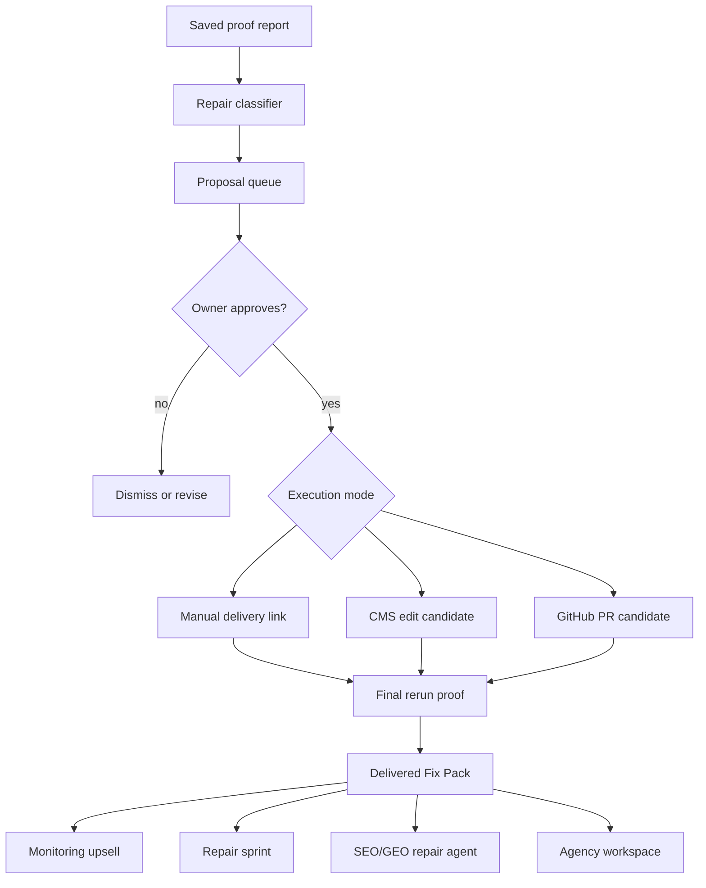

# feat: Add fix execution and staged offers

## Summary

This plan turns SEO Fix Kit into a staged repair business: first make fix execution real, then add monitoring, repair sprint, SEO/GEO repair agent, and agency workspace offers one by one.

---

## Problem Frame

SEO Fix Kit has strong proof-backed auditing, private reports, Dodo Fix Pack checkout, weekly monitors, developer API/webhooks, white-label reports, team repair boards, and large-crawl scaffolding. Competitors are selling broader automation: Outrank automates article publishing and Search Console-backed article improvements, SEOitis tracks AI visibility and runs gap-to-publish loops, and Okara sells a full AI CMO with CMS and GitHub fix execution. SEO Fix Kit should not chase all of that at once. The defensible path is to own proof-backed repair execution first, then package recurring and agency offers around that execution layer.

---

## Requirements

- R1. Every paid repair offer must start from a saved report with proven issues, not from a generic checkout page.
- R2. The app must classify repair items by execution mode: safe in-app/CMS edit, GitHub PR candidate, customer/manual task, or unsupported.
- R3. The app must let the owner approve generated fixes before anything is applied or sent as final delivery.
- R4. Delivery must include before/after proof, original report, final rerun report, customer-visible notes, and no ranking guarantees.
- R5. Billing copy must stay truthful: payment buys one proof-backed repair pass and one rerun unless a later subscription entitlement is live.
- R6. A verified site owner can subscribe to recurring proof monitoring for one or more verified sites.
- R7. Monitoring must reuse existing audit schedules, report deltas, and saved report ownership.
- R8. Monitoring must avoid pretending to fix issues; it sells detection, proof, and change alerts.
- R9. Monitoring pricing should fit the lower tier: roughly $49-$99/month once billing entitlements exist.
- R10. A site owner can buy a one-time repair sprint from a report with fixable issues.
- R11. A repair sprint must produce a scoped queue, owner approval, delivery status, and rerun proof.
- R12. A repair sprint may include manual delivery links, CMS edits, or GitHub PRs depending on integrations.
- R13. Repair sprint pricing should start around $249-$499 one-time once execution is visible and reliable.
- R14. A verified site owner can enable a recurring repair agent that prioritizes SEO and AI-search readiness repairs from live proof.
- R15. The agent must prioritize by real opportunity signals: report severity, repeat issues, Search Console or imported keyword data, report deltas, and AI-search readiness checks.
- R16. The agent must include practical AI-search readiness checks without claiming Google needs llms.txt or special AI markup.
- R17. The agent must keep owner approval before publishing, merging, or marking delivery complete.
- R18. SEO/GEO repair agent pricing can move toward $199-$399/month after recurring execution is real.
- R19. An agency owner can manage multiple client reports with branding, client links, PDF exports, issue assignment, and repair status.
- R20. Agency workspace must build on existing white-label reports, report domains, team members, and issue collaboration.
- R21. Agency workspace must separate client-facing proof from private admin notes and internal fulfillment state.
- R22. Agency pricing can move toward $299-$799/month after client/workspace limits and billing entitlements are implemented.

---

## Key Technical Decisions

- **Execute before packaging:** Build repair proposal, approval, and proof loops before adding subscription pricing. This keeps prices honest against Outrank, SEOitis, and Okara.
- **Extend Fix Pack instead of replacing it:** Existing Dodo checkout, `fix_requests`, admin status changes, delivery emails, and final rerun checks already model paid execution. The new work should deepen that path first.
- **Use entitlement rows before plan copy:** Add durable offer/entitlement state before showing monthly packages, so UI, billing, API limits, and support copy share one source of truth.
- **Keep AI-search readiness grounded in official guidance:** Google treats generative AI search as still SEO and says llms.txt is optional for Google Search. SEO/GEO checks should prioritize crawlability, helpful content, technical structure, structured data where useful, and agent-friendly site behavior without selling hacks.
- **Approval-first integration posture:** CMS and GitHub execution should start as proposed changes with explicit approval. Auto-apply can be deferred until trust, audit logs, and rollback paths exist.

---

## High-Level Technical Design

---

## Implementation Units

### U1. Repair Execution Data Model

- **Goal:** Add persistent repair proposal and execution state that can be tied to a report, fix request, issue, approval, execution mode, and rerun proof.
- **Requirements:** R1, R2, R3, R4, R5
- **Dependencies:** None
- **Files:**
  - Create `migrations/0026_repair_execution.sql`
  - Modify `worker/lib/serializers.js`
  - Modify `worker/lib/report-data.js`
  - Modify `server/index.js`
  - Test `server/dodo-payment-smoke-test.js`
  - Test `server/report-retention-security-smoke-test.js`
- **Approach:** Introduce repair execution tables rather than overloading `fix_requests`. Keep each proposal tied to owner email and report id, with mode, approval status, generated copy, delivery status, and final proof references. Preserve paid reports under the existing retention guard.
- **Patterns to follow:** `migrations/0008_fix_pack_fulfillment.sql`, `migrations/0016_team_repair_board.sql`, `worker/routes/billing.js`, `worker/routes/reports.js`
- **Test scenarios:**
  - Create a paid fix request and verify repair proposals can be serialized without exposing admin-only notes.
  - Confirm protected paid report retention also preserves repair execution proof.
  - Reject unsafe proposal ids, invalid report ids, and cross-owner reads.
- **Verification:** Repair execution state can be created, listed, and retained for a paid owner without changing current checkout behavior.

### U2. Fix Classifier And Proposal Builder

- **Goal:** Convert proven findings and repair-plan items into actionable proposal modes.
- **Requirements:** R2, R3, R11, R12
- **Dependencies:** U1
- **Files:**
  - Create `shared/repair-execution.js`
  - Modify `shared/audit-engine.js`
  - Modify `worker/routes/billing.js`
  - Modify `server/index.js`
  - Test `server/audit/smoke-test.js`
- **Approach:** Add a shared classifier that maps findings to safe proposals: metadata copy, schema snippets, image alt text, canonical/hreflang instructions, performance/manual tasks, CMS candidates, and GitHub PR candidates. Do not apply changes in this unit.
- **Patterns to follow:** `shared/audit-engine.js`, `shared/platform-seo-audit.js`, `shared/resource-waterfall.js`, `shared/keyword-rank-audit.js`
- **Test scenarios:**
  - Given missing meta description and title findings, produce generated copy proposals with proof and acceptance checks.
  - Given speed, layout, or content rewrite issues, classify as manual/customer task rather than safe auto-fix.
  - Given platform proof for WordPress or ecommerce, mark eligible issues as CMS candidates only when the current product has enough public proof.
  - Given unsupported or ambiguous findings, classify as unsupported with a clear reason.
- **Verification:** Reports with fixable findings produce a proposal queue that is specific, proof-backed, and conservative.

### U3. Owner Approval And Delivery Workflow

- **Goal:** Add customer-facing and admin-facing controls for approving, revising, delivering, and proving repair execution.
- **Requirements:** R1, R3, R4, R5, R11, R17
- **Dependencies:** U1, U2
- **Files:**
  - Modify `worker/routes/billing.js`
  - Modify `worker/routes/reports.js`
  - Modify `worker/routes/admin.js`
  - Modify `src/App.jsx`
  - Modify `src/styles.css`
  - Test `server/dodo-payment-smoke-test.js`
  - Test `server/audit/smoke-test.js`
- **Approach:** Reuse the existing Fix Pack CTA, billing portal, admin queue, and team repair board. Add proposal review states before delivery, and require final rerun report proof before marking execution delivered.
- **Patterns to follow:** Fix request status transitions in `worker/routes/billing.js`; issue collaboration UI in `src/App.jsx`; fulfillment email helpers in `shared/fulfillment.js`
- **Test scenarios:**
  - Given a paid Fix Pack, the owner can see proposed fixes and approve or dismiss each one.
  - Given a proposal is not approved, admin delivery cannot mark it as completed.
  - Given final rerun report host or owner does not match the original report, delivery is rejected.
  - Given delivery succeeds, customer email includes delivery notes and final proof without ranking promises.
- **Verification:** A paid request can move from paid to in progress to delivered only through approved proposals and a valid rerun report.

### U4. Offer Entitlements And Pricing Surfaces

- **Goal:** Add a server-owned offer model for monitoring, repair sprint, SEO/GEO repair agent, and agency workspace.
- **Requirements:** R5, R9, R13, R18, R22
- **Dependencies:** U3
- **Files:**
  - Create `migrations/0027_offer_entitlements.sql`
  - Create `shared/offers.js`
  - Modify `worker/routes/billing.js`
  - Modify `worker/routes/account.js`
  - Modify `src/App.jsx`
  - Modify `README.md`
  - Modify `worker/routes/pages.js`
  - Test `server/dodo-payment-smoke-test.js`
- **Approach:** Define offers as server-owned products with feature gates, price display state, and entitlement limits. Start with disabled or beta-only states where execution is not ready. Keep Dodo as the visible pricing source when checkout is live.
- **Patterns to follow:** `FIX_PACK_OFFER` and billing summary in `worker/routes/billing.js`; Dodo config guardrails in `shared/dodo.js`; public truth in `worker/routes/pages.js`
- **Test scenarios:**
  - When an offer lacks live pricing or entitlement config, checkout is paused and UI says why.
  - Monitoring offer appears only for verified sites with audit schedules available.
  - Repair sprint offer appears only from reports with approved executable proposals.
  - SEO/GEO repair agent and agency workspace remain waitlisted or beta-gated until their dependencies exist.
- **Verification:** Offer surfaces never show a paid CTA for a capability that is not backed by an entitlement and implementation path.

### U5. Monitoring Offer

- **Goal:** Package recurring proof monitoring as the first monthly offer.
- **Requirements:** R6, R7, R8, R9
- **Dependencies:** U4
- **Files:**
  - Modify `worker/routes/audits.js`
  - Modify `worker/routes/account.js`
  - Modify `worker/lib/serializers.js`
  - Modify `src/App.jsx`
  - Test `server/audit/smoke-test.js`
- **Approach:** Reuse `audit_schedules`, report deltas, and dashboard summary. Gate monitor count and cadence through entitlement state. Add copy that sells proof and change alerts, not automatic repair.
- **Patterns to follow:** `migrations/0013_audit_schedules.sql`, `worker/routes/audits.js`, account dashboard monitor cards in `src/App.jsx`
- **Test scenarios:**
  - A monitoring-entitled owner can create recurring monitors up to the plan limit.
  - A non-entitled owner sees upgrade copy instead of creating extra monitors.
  - A no-change rerun stays calm and does not create a fake repair upsell.
  - A new proven issue surfaces a repair sprint upsell tied to the report.
- **Verification:** Monitoring can be sold as a truthful subscription layer without implying execution.

### U6. Repair Sprint Offer

- **Goal:** Package one-time repair execution around approved proposal queues.
- **Requirements:** R1, R2, R3, R4, R10, R11, R12, R13
- **Dependencies:** U3, U4
- **Files:**
  - Modify `worker/routes/billing.js`
  - Modify `shared/fulfillment.js`
  - Modify `worker/routes/admin.js`
  - Modify `src/App.jsx`
  - Test `server/dodo-payment-smoke-test.js`
  - Test `server/report-retention-security-smoke-test.js`
- **Approach:** Keep the existing Fix Pack as the lower-risk beta path, then expose Repair Sprint as the standard one-time offer when enough proposals are executable. Tie price copy to the report's scoped queue and final rerun proof.
- **Patterns to follow:** Existing `SEO Fix Pack` checkout and fulfillment flow in `worker/routes/billing.js`
- **Test scenarios:**
  - A report with executable proposals can start Repair Sprint checkout.
  - A report without executable proposals keeps the lower-friction monitoring path and avoids charging for unsupported work.
  - Paid sprint delivery requires approved proposal count, customer note, delivery link or integration proof, and final rerun report.
  - Refund, dispute, and failed-payment states block repeat checkout for the same report.
- **Verification:** Repair Sprint can be priced higher than the beta Fix Pack because it visibly includes execution state and proof.

### U7. SEO/GEO Repair Agent

- **Goal:** Add recurring prioritized repair proposals for SEO and AI-search readiness.
- **Requirements:** R14, R15, R16, R17, R18
- **Dependencies:** U4, U5, U6
- **Files:**
  - Create `shared/geo-readiness.js`
  - Modify `shared/audit-engine.js`
  - Modify `shared/keyword-rank-audit.js`
  - Modify `worker/routes/audits.js`
  - Modify `worker/routes/account.js`
  - Modify `src/App.jsx`
  - Test `server/audit/smoke-test.js`
- **Approach:** Add practical AI-search readiness checks as repair signals, not ranking promises. Prioritize crawlability, structured technical clarity, answer-ready sections, entity clarity, schema where useful, Search Console/imported opportunity rows, and agent-friendly browser accessibility. Treat `llms.txt` as optional for non-Google systems and explicitly not required for Google Search.
- **Patterns to follow:** `shared/local-seo-audit.js`, `shared/keyword-rank-audit.js`, existing `llms.txt` route in `worker/routes/pages.js`
- **Test scenarios:**
  - Given a site lacks clear answer sections and organization schema, produce SEO/GEO proposals with proof and acceptance checks.
  - Given Google-specific output, do not claim llms.txt improves Google generative AI visibility.
  - Given imported keyword rows with page-two opportunities, prioritize those above low-severity metadata polish.
  - Given recurring agent entitlement is missing, proposals remain visible as upgrade context but no recurring agent actions run.
- **Verification:** SEO/GEO repair agent surfaces defensible recurring repair work without drifting into unsupported AI-search hacks.

### U8. Agency Workspace Offer

- **Goal:** Package multi-client reporting, collaboration, and repair tracking for agencies.
- **Requirements:** R19, R20, R21, R22
- **Dependencies:** U4, U6
- **Files:**
  - Modify `worker/routes/reports.js`
  - Modify `worker/routes/account.js`
  - Modify `worker/lib/serializers.js`
  - Modify `src/App.jsx`
  - Modify `shared/white-label-report.js`
  - Test `server/report-retention-security-smoke-test.js`
  - Test `server/audit/smoke-test.js`
- **Approach:** Reuse white-label report branding, client share links, report domains, PDF export, team members, and issue collaboration. Add entitlement limits for client sites, shared reports, team seats, and branded domains.
- **Patterns to follow:** `migrations/0015_white_label_reports.sql`, `migrations/0016_team_repair_board.sql`, `worker/routes/reports.js`, white-label UI sections in `src/App.jsx`
- **Test scenarios:**
  - Agency-entitled owner can brand and share client reports within plan limits.
  - Shared client report excludes admin notes, provider state, private tokens, and internal billing details.
  - Team member assignment respects owner boundaries and active teammate limits.
  - Non-entitled owner sees upgrade copy instead of agency-only controls.
- **Verification:** Agency workspace can be sold as a client-proof and repair-tracking layer without exposing private state.

### U9. Public Truth, Terms, And Launch Verification

- **Goal:** Keep public/product truth aligned as each offer moves from beta-gated to sellable.
- **Requirements:** R4, R5, R8, R13, R16, R18, R21, R22
- **Dependencies:** U4, U5, U6, U7, U8
- **Files:**
  - Modify `README.md`
  - Modify `worker/routes/pages.js`
  - Modify `src/App.jsx`
  - Modify `worker/routes/billing.js`
  - Test `server/audit/smoke-test.js`
  - Test `server/dodo-payment-smoke-test.js`
- **Approach:** Update public copy, `llms.txt`, support, terms, billing labels, and in-app empty states after each offer is backed by implementation. Keep beta gates visible where a capability is not yet sellable.
- **Patterns to follow:** Product boundary section in `README.md`; `llmsText`, `supportHtml`, and `termsHtml` in `worker/routes/pages.js`
- **Test scenarios:**
  - Public `llms.txt` lists only live claims and clear boundaries.
  - Terms and support copy keep no-ranking-promise language for every offer.
  - Billing UI never displays a hardcoded fallback price when Dodo pricing is unavailable.
  - The app build includes no private provider secrets in client-visible output.
- **Verification:** Public surfaces, billing surfaces, and repo docs tell the same story after each staged release.

---

## Phased Delivery

- Phase 1: U1-U3 make execution real inside the current Fix Pack flow.
- Phase 2: U4-U5 add offer entitlement scaffolding and monitoring.
- Phase 3: U6 promotes one-time execution into Repair Sprint.
- Phase 4: U7 adds recurring SEO/GEO repair proposals.
- Phase 5: U8 packages agency workspace.
- Phase 6: U9 updates public truth after each capability is live.

---

## Scope Boundaries

### Deferred for Later

- Automatic CMS publishing without review.
- Automatic GitHub merge or deploy.
- Proprietary backlink discovery.
- Full AI visibility prompt tracking across ChatGPT, Claude, Perplexity, Gemini, AI Mode, and Grok.
- Daily article generation.

### Outside This Product's Identity

- Replacing broad AI CMO suites across social, community, UGC, and content channels.
- Selling guaranteed rankings, traffic, indexing, revenue, or AI citations.
- Publishing unreviewed AI content as the core wedge.

---

## Risks And Dependencies

- **Billing risk:** Monthly plans require clear Dodo product mapping and webhook-confirmed entitlement state before public pricing.
- **Execution trust risk:** CMS and GitHub integrations can damage live sites if they skip approval, preview, or rollback paths.
- **AI-search claim risk:** GEO copy can become unsupported quickly; anchor checks in official guidance and avoid magic-file claims.
- **Scope risk:** Competitor pressure may tempt content automation. Defer daily article generation until repair execution is working and validated.
- **Operational risk:** Repair Sprint and agency workspace increase support load. Admin queue, status notifications, and due dates must remain reliable.

---

## Documentation And Operational Notes

- Update `README.md` and `worker/routes/pages.js` after each phase, not before.
- Keep `specs/008-fix-execution-offers/spec.md` as the product source for offer sequencing.
- Run `npm run check` before considering any phase ready for PR or deploy.
- Run the installed `autoreview` gate before any PR-ready, merge, release, or deploy action.

---

## Sources And Research

- Outrank: product page and article-improvements docs show daily content automation, CMS publishing, backlink exchange, and Search Console-backed article refreshes.
- SEOitis: product page and FAQ show AI visibility tracking, prompt/citation analysis, article generation, publishing, and full gap-to-article-to-measure loops.
- Okara: docs and pricing pages show AI CMO positioning, SEO/GEO analytics, CMS integrations, GitHub-linked coding fixes, daily content, and multi-agent marketing.
- Google Search Central: generative AI search guidance says SEO fundamentals still apply, crawlability and technical clarity matter, llms.txt is optional for Google Search, and unsupported GEO hacks should be avoided.
- Local repo: `README.md`, `worker/routes/billing.js`, `worker/routes/audits.js`, `worker/routes/reports.js`, `worker/routes/developer-api.js`, `src/App.jsx`, and migrations `0013` through `0025` show the current proof, billing, monitoring, API, white-label, team, and retention foundations.
