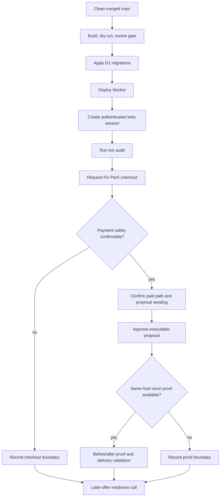

# chore: Activate production repair flow

## Summary

Activate the shipped repair-flow code in production, prove one real audit-to-Fix-Pack path, and make an honest readiness call for the later offers.

---

## Problem Frame

The repair execution and staged offer code is already merged. The remaining work is operational proof: deploy the code, apply the production schema, exercise the private live flow, and separate what is ready to sell from what still needs real execution evidence.

---

## Requirements

- R1. Production must run the merged repair-flow code after the normal build, dry-run, and review gates pass.
- R2. Production D1 must include the repair execution and offer entitlement migrations before live repair paths are counted as ready.
- R3. A real live audit must create a saved private report through the production app, not a local-only report or static homepage check.
- R4. A Fix Pack request must start from that saved report and reach Dodo checkout creation when production payment config allows it.
- R5. A live payment may be counted only if a safe Dodo test path or explicit manual completion is available; otherwise record checkout creation as the verified boundary.
- R6. At least one executable repair proposal must be approved by the report owner before delivery is counted as execution-ready.
- R7. Before/after proof requires a later rerun report for the same owner and host, plus a delivery note and proof link.
- R8. Monitoring, Repair Sprint, SEO/GEO Repair Agent, and Agency Workspace readiness must be based on verified production behavior, not roadmap copy.

---

## Key Technical Decisions

- **Use the production private-beta path:** The app intentionally disables anonymous public audits, so activation uses admin-created invite access or an equivalent authenticated beta session.
- **Keep payment proof honest:** Automated work can create and inspect a checkout session, but it must not claim a paid transaction unless Dodo confirms it or Nish completes it.
- **Record blockers once:** If a gate is blocked by missing production auth, Dodo merchant state, email delivery, paid webhook confirmation, or customer action, record that boundary and continue to the next safe verification step.
- **Fix only live-only defects:** Do not expand product scope during activation. Code changes are allowed only for defects found while proving the shipped flow.

---

## High-Level Technical Design

---

## Implementation Units

### U1. Production Gate Check

- **Goal:** Confirm the repo state, dependency state, build output, dry-run deploy, and final review gate are clean before production mutation.
- **Requirements:** R1
- **Dependencies:** None
- **Files:**
  - Read `package.json`
  - Read `wrangler.jsonc`
  - Read `README.md`
  - Read `migrations/0026_repair_execution.sql`
  - Read `migrations/0027_offer_entitlements.sql`
- **Approach:** Verify local `main` matches remote, run the project verification path, run Cloudflare deploy dry-run, and run the required review gate on the exact production-bound tree.
- **Patterns to follow:** Existing `npm run check` and `npm run cf:dry-run` verification surfaces.
- **Test scenarios:**
  - Build and smoke tests pass on the production-bound tree.
  - Cloudflare dry-run sees the Worker entrypoint, assets, bindings, routes, and migrations without deployment.
  - Review gate returns no accepted/actionable findings.
- **Verification:** The tree is production-ready before D1 or Worker production state changes.

### U2. Production Migration And Deploy

- **Goal:** Apply the pending production schema changes and deploy the Worker to `seofixkit.com`.
- **Requirements:** R1, R2
- **Dependencies:** U1
- **Files:**
  - Read `migrations/0026_repair_execution.sql`
  - Read `migrations/0027_offer_entitlements.sql`
  - Read `wrangler.jsonc`
- **Approach:** Use the configured Cloudflare D1 database and Worker routes. If Cloudflare auth or safe-deploy blocks a production mutation, record that once and continue with non-mutating checks that still prove the boundary.
- **Patterns to follow:** README Cloudflare path and D1 migration notes.
- **Test scenarios:**
  - Migration status shows repair execution and offer entitlement migrations applied remotely.
  - Production deployment reports the expected Worker and custom domains.
  - `/api/health` on production reports the Worker runtime, Browser binding, D1 binding, and current version.
- **Verification:** Production is serving the shipped code against the upgraded schema.

### U3. Live Audit Proof

- **Goal:** Run one real production audit through authenticated beta access and retrieve the saved report.
- **Requirements:** R3
- **Dependencies:** U2
- **Files:**
  - Read `scripts/run-live-audit-batch.mjs`
  - Read `ops/audit-batches/owned-project-targets.json`
  - Output under `ops/audit-batches/`
- **Approach:** Use the existing live audit batch runner or the same admin-invite plus beta-session flow for one small target. Keep max pages low to reduce Browser Run cost while still producing real rendered proof.
- **Patterns to follow:** `scripts/run-live-audit-batch.mjs` invite, login, queued audit, status polling, and saved report retrieval.
- **Test scenarios:**
  - Admin invite creation succeeds without exposing the admin token.
  - Beta login returns a session cookie.
  - Production `/api/audit` queues or completes an audit.
  - The saved report includes an id, URL, pages, findings, and report URL.
- **Verification:** One production report exists and can be used as the source for a Fix Pack request.

### U4. Fix Pack Request And Payment Boundary

- **Goal:** Start a real Fix Pack request from the live report and verify the payment boundary honestly.
- **Requirements:** R4, R5
- **Dependencies:** U3
- **Files:**
  - Read `worker/routes/billing.js`
  - Read `shared/dodo.js`
  - Read `server/dodo-payment-smoke-test.js`
- **Approach:** Call the production Fix Pack request path with the owner session. If Dodo checkout config is live, verify checkout creation and stored request state. Count payment completion only with Dodo-confirmed webhook state or explicit manual payment completion.
- **Patterns to follow:** Existing `requestFixPack` checkout creation and webhook-only payment transitions.
- **Test scenarios:**
  - A saved report can create or reuse one Fix Pack request.
  - Checkout creation returns a Dodo checkout URL when config is ready.
  - Missing or not-live Dodo state pauses checkout without hardcoded pricing.
  - Payment is not marked paid manually by admin.
- **Verification:** The verified boundary is either confirmed payment or checkout-created-with-honest-blocker.

### U5. Repair Proposal Approval And Before/After Proof

- **Goal:** Approve one executable repair proposal and validate the delivery proof gate as far as production state allows.
- **Requirements:** R6, R7
- **Dependencies:** U4
- **Files:**
  - Read `worker/routes/reports.js`
  - Read `worker/routes/admin.js`
  - Read `worker/lib/report-data.js`
- **Approach:** Inspect proposal state tied to the Fix Pack request. Approve one executable proposal as the report owner only when payment is confirmed and the request is paid or in progress. Attempt delivery validation only if payment and same-host final rerun proof are available; otherwise record the exact missing gate.
- **Patterns to follow:** Owner proposal approval route and admin delivery validation in `worker/routes/reports.js` and `worker/routes/admin.js`.
- **Test scenarios:**
  - Unsupported proposals cannot be approved.
  - An executable proposal can move to owner-approved for the same owner and report only while the linked Fix Pack request is paid or in progress.
  - Delivery rejects missing payment, missing customer note, missing delivery link, or mismatched final report.
  - A same-host rerun can serve as before/after proof when available.
- **Verification:** The app proves whether repair execution is ready for paid delivery or exactly which production gate still blocks it.

### U6. Offer Readiness Call

- **Goal:** Decide what can be sold now and what must remain gated after the live proof pass.
- **Requirements:** R8
- **Dependencies:** U3, U4, U5
- **Files:**
  - Read `README.md`
  - Read `worker/routes/billing.js`
  - Read `worker/lib/offers.js`
  - Read `src/App.jsx`
- **Approach:** Compare verified production behavior against the staged offers. Keep Fix Pack as the first paid offer unless recurring proof runs, repair sprint delivery proof, repair-agent execution, or agency workspace limits are genuinely live.
- **Patterns to follow:** Existing staged offer catalog and public truth boundaries.
- **Test scenarios:**
  - Monitoring is marked ready only if recurring production proof runs are verified.
  - Repair Sprint is marked ready only if approved proposals and delivery proof are repeatable.
  - SEO/GEO Repair Agent is marked ready only if recurring prioritization and actual execution are proven.
  - Agency Workspace is marked ready only if multi-client proof, client links, limits, and private-state boundaries hold.
- **Verification:** The final readiness answer is tied to evidence from this activation pass.

---

## Scope Boundaries

- Do not add new offers during activation.
- Do not complete a live card payment unless a safe test path or explicit manual completion exists.
- Do not claim before/after proof from copy, mock data, or local-only reports.
- Do not repair unrelated technical debt unless it blocks the production proof path.

---

## Risks And Dependencies

- Cloudflare auth, D1 permissions, or safe-deploy policy can block production mutations.
- Dodo live merchant state can block checkout creation or payment confirmation.
- Email delivery must work for normal customer access, but admin-created invite access can prove the core private flow.
- Browser Run or queue delays can make the live audit slower than local tests.
- True before/after proof may require a real site change between the first report and the rerun.

---

## Operational Notes

Use local env and Keychain credentials without printing secret values. Save generated live-audit artifacts under `ops/audit-batches/` when the existing runner is used. Treat every blocker as a boundary statement with the attempted step, the production response, and the next viable step.
