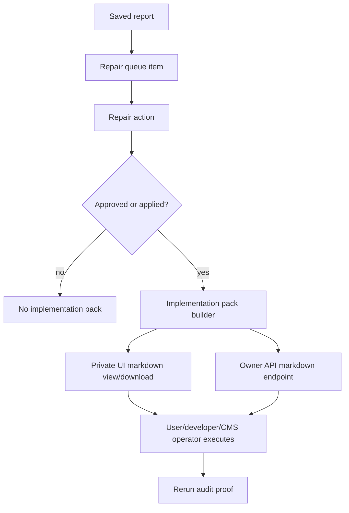

# feat: Add repair implementation packs

## Summary

Approved repair actions should produce a private implementation pack that turns proof, proposed change, acceptance criteria, and rerun instructions into an execution-ready artifact for a site owner, developer, CMS operator, or coding agent.

---

## Problem Frame

SEOFixKit now proves reports, creates paid Fix Pack requests, seeds repair proposals, and lets owners approve action records. The weak point is the apply step: marking an action applied can still mean "someone says they did it" rather than "the product gave them a complete implementation package." This plan adds a safe bridge toward real execution without provider credentials, GitHub App installation, CMS writes, or risky auto-publishing.

---

## Requirements

- R1. A repair action implementation pack must be available only to the report owner through beta session auth or an owner API token.
- R2. The pack must require an existing repair action and must refuse unsupported or ignored actions.
- R3. The pack must preserve source proof, target page, proposed change, acceptance check, rollback note, and rerun proof instructions.
- R4. The pack must adapt copy by action mode: self-serve, teammate, Fix Pack, CMS draft, or GitHub PR draft.
- R5. The pack must not claim that SEOFixKit published, merged, or applied a change by itself.
- R6. The private UI must expose the pack beside approved or applied actions without showing it on public client reports.
- R7. The Developer API must expose a sanitized implementation-pack endpoint for authenticated owner agents.
- R8. Tests must prove owner isolation, unsupported-action rejection, markdown content safety, and UI/API contract shape.

---

## Key Technical Decisions

- **Generate packs from existing action state:** Use `repair_agent_actions`, queue item snapshots, and report JSON instead of adding another table. The pack is deterministic from approved data and does not need persistence yet.
- **Markdown first:** Return a markdown artifact because it is portable to developers, CMS users, support agents, and coding agents. Avoid PDF or zip packaging until real provider integrations exist.
- **Private only:** Add routes under existing beta/API auth surfaces. Do not change `/r/:id`, white-label report payloads, or public pages to include proposed changes.
- **Execution bridge, not execution claim:** The pack can include command-style or PR-style steps, but state changes remain explicit user actions. Rerun proof stays the authority for fixed/regressed status.
- **No external integration in this slice:** GitHub PR creation, CMS publishing, and provider admin APIs remain deferred until connection, approval, audit log, and rollback paths are wired.

---

## High-Level Technical Design

---

## Implementation Units

### U1. Shared Implementation Pack Builder

- **Goal:** Build a deterministic, sanitized markdown pack from a report, queue item, and repair action.
- **Requirements:** R2, R3, R4, R5
- **Files:**
  - Create `shared/repair-implementation-pack.js`
  - Test `shared/repair-implementation-pack.test.mjs`
- **Approach:** Add a pure shared helper that validates action state, maps action mode to execution guidance, includes source proof and proposed change, adds rollback/rerun sections, and returns both structured metadata and markdown.
- **Patterns to follow:** `shared/repair-queue.js`, `shared/repair-api-serializers.js`, `shared/repair-action-rules.js`
- **Test scenarios:**
  - Approved action returns markdown with proof, proposed change, acceptance, rollback, and rerun sections.
  - Drafted or ignored action is rejected.
  - CMS and GitHub action modes get mode-specific instructions without claiming live publishing.
  - Control characters and excessive whitespace are cleaned from pack fields.
- **Verification:** Shared tests pass and the helper has no Worker-only dependencies.

### U2. Private Beta Route

- **Goal:** Let a beta session owner fetch the implementation pack for one repair action.
- **Requirements:** R1, R2, R3, R6
- **Files:**
  - Modify `worker/routes/repair-agent.js`
  - Modify `worker/index.js`
  - Test `worker/routes/repair-agent.test.mjs`
- **Approach:** Add `GET /api/reports/:reportId/repair-actions/:actionId/implementation.md`. Reuse `repairContext`, owner report checks, repair table checks, and no-store markdown headers. Fetch the action and queue item for the same owner and report before calling the shared builder.
- **Patterns to follow:** Existing `updateRepairAction` route ownership checks and private report markdown responses in `worker/routes/reports.js`.
- **Test scenarios:**
  - Owner can fetch markdown for an approved action.
  - Unauthenticated or cross-owner requests fail.
  - Drafted/ignored/unsupported actions fail with safe errors.
  - Response uses `no-store`, markdown content type, and no raw cookies or provider secrets.
- **Verification:** Worker repair-agent tests cover route dispatch and owner isolation.

### U3. Developer API Route

- **Goal:** Let authenticated owner agents retrieve the same implementation pack through the API.
- **Requirements:** R1, R3, R7, R8
- **Files:**
  - Modify `worker/routes/developer-api.js`
  - Modify `worker/index.js`
  - Test `worker/routes/developer-api.test.mjs`
- **Approach:** Add `GET /v1/audits/:auditId/repair-actions/:actionId/implementation.md` using existing audit resolution and API token ownership checks. Return markdown only, not proposed-change text inside existing issue payloads.
- **Patterns to follow:** `apiUpdateRepairAction`, `apiGetRepairQueue`, and owner-scoped audit report resolution.
- **Test scenarios:**
  - Active API token can fetch an approved action pack.
  - Revoked or wrong-owner token fails.
  - Existing public/client report payloads remain unchanged.
- **Verification:** Developer API tests prove endpoint auth and response shape.

### U4. Private Report UI Link

- **Goal:** Surface implementation packs where owners already approve and apply repair actions.
- **Requirements:** R6, R8
- **Files:**
  - Modify `src/App.jsx`
  - Modify `src/styles.css`
  - Test `src/app-contract.test.mjs`
- **Approach:** Add a "Implementation pack" link/button beside approved or applied repair actions. Keep it absent for drafted/ignored actions and public client reports. Reuse existing action state helpers instead of adding new global UI state.
- **Patterns to follow:** `TeamRepairBoard`, `repair-action-requests.js`, and existing repair action controls.
- **Test scenarios:**
  - Contract helper builds the implementation-pack URL for a report/action pair.
  - UI only renders the link when the latest action is approved or applied.
  - Link text does not imply auto-apply or publishing.
- **Verification:** App contract test and build pass.

### U5. Documentation And Truth Surfaces

- **Goal:** Update product truth to say implementation packs are live while provider writes remain deferred.
- **Requirements:** R5, R6, R8
- **Files:**
  - Modify `README.md`
  - Modify `worker/routes/pages.js`
  - Test `worker/routes/pages.test.mjs`
- **Approach:** Add implementation packs to private repair-agent capability lists, while preserving the explicit no-CMS-publish/no-GitHub-PR/no-provider-admin boundary.
- **Patterns to follow:** Existing methodology/limits copy and README capability boundary.
- **Test scenarios:**
  - Public support/methodology copy mentions implementation packs as private approved-action artifacts.
  - Public copy still denies auto-publish, real GitHub PR creation, and private provider writes.
- **Verification:** Public page tests and full project check pass.

---

## Scope Boundaries

### Deferred For Later

- GitHub App installation and PR creation.
- CMS/Webflow/WordPress/Shopify writes.
- Provider credential storage for customer integrations.
- Auto-apply or auto-merge behavior.
- Persisted pack versions or downloadable zip bundles.

### Outside This Product's Identity

- Unapproved site changes.
- Browser-side provider admin API calls.
- Ranking, traffic, or AI-citation guarantees.
- Public exposure of proposed change text or private repair notes.

---

## Risks And Dependencies

- **Risk: implementation pack sounds like auto-execution.** Mitigation: copy must say it is an approved-action artifact and rerun proof remains required.
- **Risk: private proposed changes leak into public/client views.** Mitigation: add only private beta/API routes and do not alter white-label report serializers.
- **Risk: API endpoint widens data exposure.** Mitigation: reuse owner-scoped audit resolution and return markdown only after the action belongs to the owner and report.
- **Dependency: repair queue tables.** The pack depends on `repair_queue_items` and `repair_agent_actions`; missing tables should fail closed like the existing repair-agent routes.

---

## Sources

- Origin requirements: `docs/brainstorms/2026-06-18-seofixkit-agent-repair-model-requirements.md`
- Existing repair model plan: `docs/plans/2026-06-18-002-feat-seofixkit-agent-repair-model-plan.md`
- Execution-offers plan: `docs/plans/2026-06-19-001-feat-fix-execution-offers-plan.md`
- Current repair routes: `worker/routes/repair-agent.js`, `worker/routes/developer-api.js`
- Current repair state helpers: `shared/repair-queue.js`, `worker/lib/repair-agent-actions.js`
