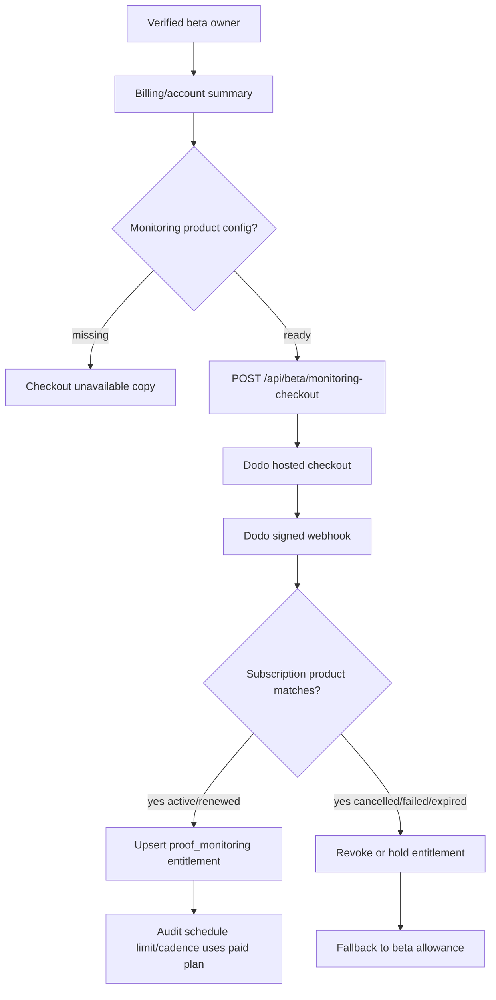

# feat: Add paid Proof Monitoring activation

## Summary

This plan turns Proof Monitoring from beta allowance into the first recurring offer that can be sold when its Dodo subscription product is configured. The feature must keep the product honest: checkout can open from a verified workspace, but monitoring access only becomes paid/active from stored entitlements or subscription webhooks.

---

## Problem Frame

SEO Fix Kit is now strong enough to sell a narrow Fix Pack beta, but it is not yet a full self-serve SaaS because recurring paid offers are still gated. The next durable move is to activate the smallest recurring product: proof monitoring for verified sites. This builds toward the 11/10 self-serve goal without pretending CMS writes, GitHub PRs, AI-engine sampling, or the full repair agent are live.

Current Dodo documentation supports hosted checkout sessions for both one-time and subscription products, and subscription webhooks should sync subscription state instead of relying on client redirects. The repo already uses Worker-owned Dodo checkout creation and webhook verification for Fix Pack; monitoring should follow that pattern.

---

## Requirements

- R1. A signed-in beta owner can request a Proof Monitoring checkout only when at least one verified site or active monitor exists.
- R2. The Worker must create monitoring checkout sessions only when `DODO_SEOFIXKIT_PRODUCT_MONITORING_ID` and the existing Dodo API, brand, environment, and webhook config are present.
- R3. If monitoring product config is missing, API and UI must fail closed with a plain "not configured" state instead of showing a paid CTA.
- R4. Monitoring checkout metadata must carry the owner email, offer key, selected site/host context, and product key without exposing secrets or checkout URLs in summaries.
- R5. Active monitoring access must continue to come from `offer_entitlements`, not from a successful redirect or locally cached checkout.
- R6. Dodo subscription webhooks must upsert/revoke the `proof_monitoring` entitlement when a matching subscription product is activated, updated, renewed, put on hold, cancelled, failed, or expired.
- R7. Existing audit schedule limits and cadence must use paid entitlement limits when active and beta allowance limits otherwise.
- R8. Public, billing, and app copy must state that paid monitoring is available only when checkout and subscription entitlement activation are wired; it must not imply repair execution.
- R9. Tests must cover configured checkout, missing config, unauthorized access, entitlement activation from webhook, entitlement revocation from webhook, and product mismatch.

---

## Key Technical Decisions

- KTD1. **Reuse checkout sessions:** Use the existing Dodo `/checkouts` pattern with a subscription product id rather than adding deprecated subscription creation APIs.
- KTD2. **Entitlement is the source of truth:** A checkout URL is only an invitation to pay. `offer_entitlements` remains the switch that raises monitor limits and changes billing state.
- KTD3. **Subscription webhooks activate monitoring:** Add subscription event handling beside payment handling in `worker/routes/billing.js`, using Dodo's signed webhook endpoint and product matching.
- KTD4. **Fail closed without dashboard product setup:** The code can ship before the live monitoring product id exists, but it must report checkout as unavailable until the env var is set.
- KTD5. **Do not broaden the offer:** This slice sells detection, reruns, deltas, and alerts. Repair Sprint, CMS/GitHub execution, AI visibility tracking, and agency subscriptions stay gated.

---

## High-Level Technical Design

---

## Implementation Units

### U1. Dodo Monitoring Product Config

- **Goal:** Add product-specific Dodo helpers for the Proof Monitoring subscription without breaking Fix Pack config.
- **Requirements:** R2, R3, R4
- **Files:**
  - Modify `shared/dodo.js`
  - Modify `shared/offers.js`
  - Modify `worker/routes/health.js`
  - Test `worker/index.test.mjs`
- **Patterns to follow:** `dodoProductId`, `dodoCheckoutConfigStatus`, `offerCatalog`, `getDeepHealth`
- **Test scenarios:**
  - Monitoring checkout is unavailable when the monitoring product id is missing.
  - Deep health reports monitoring checkout readiness separately from Fix Pack checkout readiness.
  - Existing Fix Pack readiness remains unchanged.
- **Verification:** Product readiness is visible to server code and public-safe health without exposing provider ids.

### U2. Monitoring Checkout Route

- **Goal:** Create a protected checkout endpoint for Proof Monitoring.
- **Requirements:** R1, R2, R3, R4, R5
- **Files:**
  - Modify `worker/routes/billing.js`
  - Modify `worker/index.js`
  - Modify `server/index.js`
  - Test `worker/routes/billing.test.mjs`
- **Patterns to follow:** `requestFixPack`, `createDodoFixPackCheckout`, `getBillingSummary`
- **Test scenarios:**
  - Unauthorized requests return private beta auth errors.
  - Owners without verified sites or active monitors cannot open checkout.
  - Missing Dodo monitoring product config returns 503 without calling Dodo.
  - Configured checkout calls Dodo with the monitoring product id and safe metadata.
  - Checkout response omits provider secrets and raw subscription internals.
- **Verification:** A verified owner can start hosted monitoring checkout only through the Worker.

### U3. Subscription Webhook Entitlements

- **Goal:** Sync Dodo subscription lifecycle events into `offer_entitlements`.
- **Requirements:** R5, R6, R7, R9
- **Files:**
  - Modify `worker/routes/billing.js`
  - Modify `worker/lib/offers.js`
  - Test `worker/routes/billing.test.mjs`
- **Patterns to follow:** `handleDodoWebhook`, `reserveDodoWebhookEvent`, `processDodoPaymentWebhook`, `offerEntitlementsForOwner`
- **Test scenarios:**
  - `subscription.active`, `subscription.updated`, and `subscription.renewed` upsert an active monitoring entitlement for matching product metadata.
  - `subscription.cancelled`, `subscription.failed`, `subscription.expired`, and `subscription.on_hold` move the entitlement out of active access.
  - Webhooks with the wrong product id or missing owner email are ignored and logged as safe no-ops.
  - Duplicate webhook ids remain idempotent.
- **Verification:** Paid monitoring access cannot be spoofed by redirects and is derived from signed provider events.

### U4. Account, Billing, And Public Truth

- **Goal:** Surface monitoring as a real-but-config-gated recurring offer across private billing/account views and public docs.
- **Requirements:** R3, R5, R7, R8
- **Files:**
  - Modify `worker/routes/billing.js`
  - Modify `worker/routes/account.js`
  - Modify `src/App.jsx`
  - Modify `README.md`
  - Modify `worker/routes/pages.js`
  - Test `server/product-truth-smoke-test.js`
  - Test `src/app-contract.test.mjs`
  - Test `worker/routes/pages.test.mjs`
- **Patterns to follow:** Billing offer ladder, account monitoring summary, package ladder truth copy
- **Test scenarios:**
  - Billing summary shows monitoring checkout available only when product config is ready.
  - Account summary shows active paid monitoring only from an entitlement.
  - Public package copy distinguishes Fix Pack, paid monitoring, and still-roadmap repair execution.
  - Product truth tests prevent claims about subscriptions, repair agents, CMS writes, or AI visibility when not live.
- **Verification:** Buyers can understand and buy the first recurring monitoring offer without confusing it for repair execution.

---

## Scope Boundaries

- This plan does not create the Dodo dashboard product; it only wires the app to `DODO_SEOFIXKIT_PRODUCT_MONITORING_ID`.
- This plan does not perform a real-card purchase. Live proof still requires a customer or founder card transaction after the product id is configured.
- This plan does not implement Repair Sprint checkout, SEO/GEO Repair Agent subscription checkout, Agency Workspace checkout, CMS writes, GitHub PRs, or AI-engine citation monitoring.
- This plan does not weaken existing site verification, private report ownership, or Dodo webhook signature requirements.

---

## Risks And Dependencies

- **Dodo product setup:** The app cannot make monitoring live until the subscription product exists and the Worker env var is configured.
- **Webhook payload shape:** Dodo subscription payloads can carry customer and product fields differently than payment payloads, so parsing must be tolerant but conservative.
- **Truth drift:** If copy says monitoring is paid-live before entitlement activation works, the product overclaims. Product-truth tests should guard this.
- **Entitlement limits:** The first paid limits can start small and explicit: one monitored site, weekly cadence, configurable by entitlement `limits_json`.

---

## Sources And Research

- Dodo Checkout Sessions docs: checkout sessions support one-time and subscription products, return a hosted `checkout_url`, and are valid for 24 hours.
- Dodo Subscription Webhook docs: subscription events include active, updated, on hold, renewed, cancelled, failed, and expired states; `subscription.updated` is the sync mechanism.
- Dodo Changelog: recent 2026 updates include subscription retries, subscription lifecycle emails, customer portal cancellation reasons, and entitlement-related product work.
- Existing repo plan: `docs/plans/2026-06-19-001-feat-fix-execution-offers-plan.md`
- Existing repo requirement source: `docs/brainstorms/2026-06-18-seofixkit-agent-repair-model-requirements.md`
